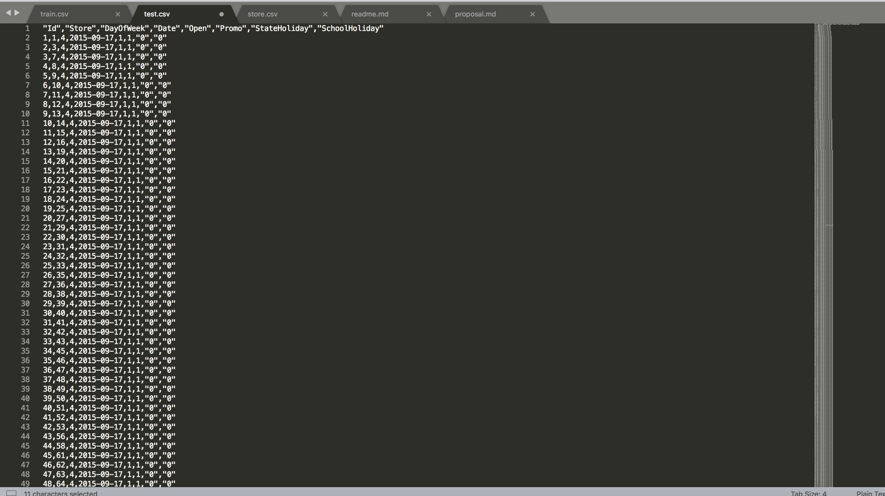
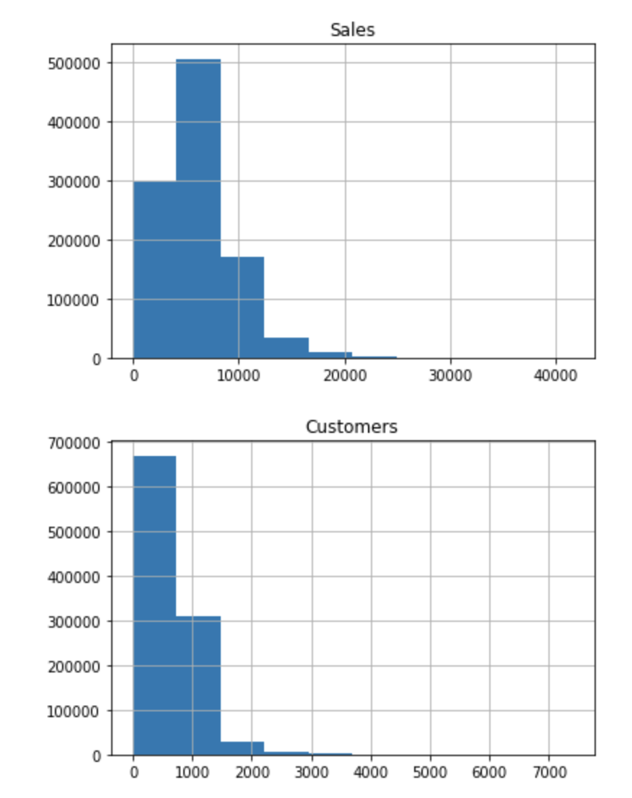
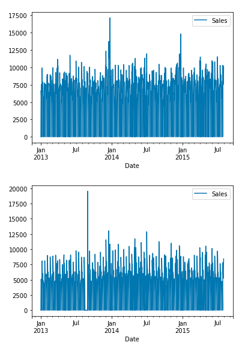
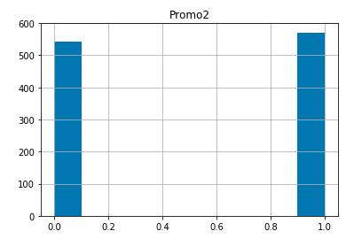

# 机器学习纳米学位
## 毕业项目
刘晟西
 
2018年6月27日
 

## I. 问题的定义

### 项目概述

该项目是kaggle上面的[Rossmann Store Sales](https://www.kaggle.com/c/rossmann-store-sales)竞赛。竞赛目标是根据Rossmann公司提供的数据预测未来一段时间内该公司1115家商店的销量。

该项目的出发点是通过历史的销售数据和商店的特征数据对未来的销售进行预测。销售预测对于零售行业有重大的运营指导意义，可以帮助企业掉陪资源，减少资源闲置和冗余资源的消耗，从而提高效率，降低成本。

该项目提供的原始数据包括：
- store.csv: 1115家商店的特征数据
- train.csv: 相应商店在特定时间区间的销售数据，包括对应日期的特征数据（是否是假期等）
- test.csv：用于测试的数据，最终要使用训练好的模型根据该数据提供的数据对特定商店在特定日期的销售做出预测，并上传kaggle得到模型的最终评分。

### 问题陈述

该问题，从数据上来看，提供了结构化的数据，由于过去的销售数据已经提供，所以是一个监督学习问题。同时，由于预测目标销售数据是一个连续变量，所以这是一个回归问题。

要解决这个问题，首先需要对提供的过往数据中的特征数据进行处理，即，特征工程，包括：对特征中的非标准数据标准化，对分类数据进行独热编码，对日期数据进行处理，填充Na数据等等。

特征工程完成后，需要将数据划分为训练集和验证集，进行线下训练。

然后要选择合适的模型来进行训练。目前kaggle上的主流是结构化数据用XGBoost，非结构化数据用cnn，因此笔者也采用了XGBoost模型来进行训练。

由于读入数据是以pandas的dataframe格式存储的，首先需要将数据转化为XGBoost专属的DMatrix格式，然后建立模型，进行训练。

接下来是反复的调整参数工作，最终得到较为满意的线下训练结果后，上传kaggle得到最终得分。

Kaggle上该竞赛排名靠前的得分均为0.10xx（数字越小，排名越靠前），笔者作为初学者，目标是得到0.11xx的最终得分。

### 评价指标

该项目采用竞赛官方给定的评价指标RMSPE，该指标计算公式如下：

该指标是常见指标RMSE（有的写作RMSD）的一个变体，RMSE的计算公式如下：

RMSE全称为均方根误差，公式中y代表真实值，y\_hat代表的是预测值，该指标代表的是预测值和观察到的值之差的样本标准差（[维基百科](https://zh.wikipedia.org/wiki/%E5%9D%87%E6%96%B9%E6%A0%B9%E8%AF%AF%E5%B7%AE)）。但RMSE的缺点是与数值范围相关，而该项目中预测的销售值的分布是偏置分布的（见后面可视化），因此采用衡量预测值和观测值之差百分比的RMSPE更为合适。

## II. 分析
### 数据的探索

用sublime打开3个包含待处理数据的csv文件，观察数据的特点。一共3个数据文件。

首先，对于待处理的数据中的特征域，官方给出了注释如下：

 Data fields

Most of the fields are self-explanatory. The following are descriptions for those that aren't.

- Id - an Id that represents a (Store, Date) duple within the test set
 - Store - a unique Id for each store
- Sales - the turnover for any given day (this is what you are predicting)
- Customers - the number of customers on a given day
- Open - an indicator for whether the store was open: 0 = closed, 1 = open
- StateHoliday - indicates a state holiday. Normally all stores, with few exceptions, are closed on state holidays. Note that all schools are closed on public holidays and weekends. a = public holiday, b = Easter holiday, c = Christmas, 0 = None
- SchoolHoliday - indicates if the (Store, Date) was affected by the closure of public schools
- StoreType - differentiates between 4 different store models: a, b, c, d
- Assortment - describes an assortment level: a = basic, b = extra, c = extended
- CompetitionDistance - distance in meters to the nearest competitor store
- CompetitionOpenSince[Month/Year](#) - gives the approximate year and month of the time the nearest competitor was opened
 - Promo - indicates whether a store is running a promo on that day
-  Promo2 - Promo2 is a continuing and consecutive promotion for some stores: 0 = store is not participating, 1 = store is participating
 - Promo2Since[Year/Week](#) - describes the year and calendar week when the store started participating in Promo2
- PromoInterval - describes the consecutive intervals Promo2 is started, naming the months the promotion is started anew. E.g. "Feb,May,Aug,Nov" means each round starts in February, May, August, November of any given year for that store

*store.csv*
该文件存储的是1115个商店的特征数据，可以看到除了商店编号，一共存储了9个特征域。这些特征域当中，
- ’StoreType’, ‘Assortment’为无序离散分类变量，需要进行独热编码
- ‘CompetitionDistance’为连续变量，可以不处理
- ‘CompetitionSinceMonth’, ‘CompetitionSinceYear’为有序分类变量，XGBoost可以直接处理，所以特征工程部分不用处理
- ‘Promo2’为布尔变量，也可以不处理
- ‘Promo2SinceWeek’, ‘Promo2SinceYear’为有序离散变量，但在列中含有大量为NaN的数据，需要转化为0值
- ‘PromoInterval’ 为离散无序分类变量，需要进行独热编码

*train.csv*
该文件存储的是这些商店从2013年1月1日到2015年7月1日的销售数据，除了商店编号，还存储了8个特征域。这些特征域当中，
- ‘DayofWeek’是一个有序离散变量，可以不用处理
- ‘Date’是一个日期数据，实际上是以字符串形式存储的日期数据，对于该类数据有2种处理办法：1. 是将字符串转化为时间戳类型数据，然后将时间戳再转化为浮点值，再归一化。2. 是将字符串分割为3个分类特征域，分别是年，月，日。在后面的处理过程中，可以看到笔者对于两种方法均进行了尝试。
- ‘Sales’存储的是销售数据，也是训练的目标。
- ‘Customers’数据是连续型变量，但是该特征域在测试数据集中不存在，因此训练之前需要将该特征域排除。
- ‘Open’， ‘Promo’，‘SchoolHoliday’都是布尔型数据，不需要处理。
- ‘StateHoliday’存储的实际是分类变量，由0和字母组成（这里要特别注意，因为不注意观察会将该变量看作是布尔变量，笔者就犯了该错误），因此需要做独热编码

*test.csv*

该文件存储的是测试集的特征域，与训练集的特征域基本相同，多了一个‘Id’特征，主要用于上传最终结果，少了‘Sales’特征，这是预测目标，少了‘Customers’特征，所以在训练时需要从训练集中去除。（这也合理，怎么能知道未来顾客有多少呢？这个数实际应该是和训练目标高度相关的数据。）

### 探索性可视化

下面我们将数据进行可视化，看看数据分布的特点。整个可视化的过程完整的记录在了该项目的github库的Visual.ipynb文件中。
首先来看train.csv中的数据。在其特征域中，‘Sales’和‘Customers’都可以绘制直方图如下：

可以看到，这两个特征维度都出现明显的偏置分布，对应现实世界的意义是Rossmann公司大部分的商店都是单日销售额在10000以下（单位未知），顾客数在1000以下的商店，但仍有少数几家销售额和顾客数远超该数值的大型商店。

对于我们此次的项目而言，这样的数据分布使得后期我们需要对‘Sales’数据作取对数处理（‘Customers’维度要去掉，就不必处理了）。

此外，还可以将‘Sales’数据作时序排列，由于有1115家商店，为了简单起见，我们随机选取5家商店，看他们的时序数据。

从时间序列来看，除了某些商店在特定时间段因为关门没有销售数据外，销售额在时间序列上还是呈现出了一定的规律性，可以猜测，该项目对销售额的时间周期性的处理将是关键。

train.csv中其他数据可以不必可视化。  

接下来是对store.csv进行可视化。
‘CompetitionDistance’

从直方图可以看到，Rossmann的商店大部分与竞争对手的距离都在10000（单位未知）以下，但也有少数超过50000，后续在进行训练时，如果这些异常值影响到效率，则需要对该维度作对数处理。

‘CompetitionOpenSinceMonth‘

可以看到开张了12个月的竞争对手最多，出现了一定程度的偏置，但并不严重，因此在训练前可以不处理这个维度的数据。

‘CompetitionOpenSinceYear'

可以看到绝大部份竞争对手都是在2000年以后开张的，该数据偏置是非常严重的，后续可能可以处理该数据以提高训练效率。

‘Promo2’

可以看到，参与和不参与持续促销的商店基本是一半一半。

'Promo2SinceWeek’（剔除0值）

参与持续促销的商店大部分都是在日历第15周和35-40周参与的。可以看出Rossmann公司的持续促销活动会更多在一年中的特定时间段开展，如果训练后的模型呈现出持续促销活动对于销售额具有强相关性，可以据此深入研究，优化Rossmann公司持续促销活动的安排。

'Promo2SinceYear'（剔除0值）

可以看到11，13，14年的促销活动额外多，训练后也可根据该特征变量与销售额的相关性对相关促销活动做出调整。

此外，我们还可以对‘StoreType’，‘Assortment’以及‘PromoInterval’的分布情况做一个简单的可视化，有助于我们对数据的情况有一个整体把握。

‘StoreType’

可以看到a类的商店最多，占到一半以上，其次是d类，然后是c类，最少的是b类，只有极少数b类商店。如果训练结果证明商店类型与销售额有较强相关性，可以为未来新开店或者现有店转型提供一些参考。（当然实际开设什么种类的店面取决于很多因素）。

‘Assortment’

可以看到‘Assortment’主要为a类和c类，只有很少的b类。

‘PromoInterval’

可以看到一共有3种促销间隔，其中‘一月，四月，七月、十月’的间隔最为常见，超过一半，剩下的两种间隔几乎平分秋色。

对于测试集就没有必要可视化了。

在以上可视化中，最为重要的是销售额的偏置以及销售额在时间序列上呈现的频率分布。

### 算法和技术

本项目使用了XGBoost算法，XGBoost是基于GBDT改进的算法，目前广泛用于结构化数据的机器学习，尤其在竞赛中得到了大力的应用。

XGBoost 是"极端梯度上升"(Extreme Gradient Boosting)的简称,是一种现在在数据科学竞赛的获胜方案很流行的算法，它的流行源于在著名的Kaggle数据科学竞赛上被称为"奥托分类"的挑战。由于其高效的C++实现，xgboost在性能上超过了最常用使用的R包gbm和Python包sklearn。例如在Kaggle的希格斯子竞赛数据上，单线程xgboost比其他两个包均要快出50%，在多线程上xgboost更是有接近线性的性能提升。由于其性能和使用便利性，xgboost已经在Kaggle竞赛中被广泛使用，在2015年29支Kaggle冠军队伍中就有17队采用XGBoost工具包。[5]

在该项目的kaggle竞赛中，靠前的名次几乎都采用了XGBoost来完成训练。下面对XGBOOST和GBDT作一个简单的介绍。[1]

GBDT全称为Gradient Boosting Decision Tree，它结合了boosting和gradient的思想，即一方面使用弱学习器的累加来进行毕竟，同时在迭代过程中使用梯度下降的思想改进弱学习器。GBDT底层的弱学习器主要为回归树。这个参考文献[1]中举的例子简明易懂，引用如下：
> GBDT的核心就在于，每一棵树学的是之前所有树结论和的残差(负梯度)，这个残差就是一个加预测值后能得真实值的累加量。比如A的真实年龄是18岁，但第一棵树的预测年龄是12岁，差了6岁，即残差为6岁。那么在第二棵树里我们把A的年龄设为6岁去学习，如果第二棵树真的能把A分到6岁的叶子节点，那累加两棵树的结论就是A的真实年龄；如果第二棵树的结论是5岁，则A仍然存在1岁的残差，第三棵树里A的年龄就变成1岁，继续学。 Boosting的最大好处在于，每一步的残差计算其实变相地增大了分错instance的权重，而已经分对的instance则都趋向于0。这样后面的树就能越来越专注那些前面被分错的instance。

此外，GBDT还应用了缩减的思想（Shrinkage），即为每棵树设置一个weight，累加时要乘以这个权重，以小步逼近真实结果，避免过拟合。

XGBoost是基于GBDT的一种改良，可以自动利用CPU的多线程进行并行计算（GBDT是串行计算），增加了剪枝，控制了模型的复杂度。

XGBoost的并行计算并非是tree粒度的并行，而是特征力度的并行。XGBoost在训练之前预先对数据进行了排序并保存为block结构，迭代时重复使用该结构，大大减小计算量，同时在节点分裂时需要计算各个特征的增益（计算公式如下图），选取增益最大的特征进行分裂，各个特征的增益计算可以多线程进行。[1]

此外XGBoost还有以下一些优势：
- 公式中使用了二阶导数信息，而GBDT只用了一阶导数；
- 支持自定义的代价函数，只要该函数一阶、二阶可导；（本项目利用到了该特性）
- 在代价函数中加入了正则项，用于控制模型的复杂度，防止过拟合；
- 支持列抽样，降低过拟合，减少计算；

具体到本项目，数据在读入后被存储为pandas的DataFrame数据结构，然后转化为XGBoost特有的DMatrix数据结构存储。DMatrix这种数据结构对象定义如下：
	class xgboost.DMatrix(data, label=None, missing=None, weight=None, silent=False, feature_names=None, feature_types=None, nthread=None)

在处理数据时，通常将DataFrame形式存储的特征维度传入data参数，将numpy array形式存储的标签（销售额）传入label参数。

然后构造一个模型进行训练，调用训练的API如下：
	xgboost.train(params, dtrain, num_boost_round=10, evals=(), obj=None, feval=None, maximize=False, early_stopping_rounds=None, evals_result=None, verbose_eval=True, xgb_model=None, callbacks=None, learning_rates=None)`

本项目用到的参数如下：
	#设定参数
	param = {'max_depth': 10, 'eta': 0.01, 'silent': 0, 'objective': 'reg:linear','min_child_weight': 6,'colsample_bytree': 0.8, 'subsample':0.9}
	#设定迭代次数
	num_round = 13034
	#调用API进行训练
	model = xgb.train(
			param, dtrain, num_round, feval = feval_c, 
			evals = [(dtrain, 'train'), (dval, 'val')], early_stopping_rounds = 100, 
			verbose_eval = True
		)
下面对本项目用到的参数分别作出解释：[2][3]

首先来看param字典，该字典定义了模型用到大部分参数，包括：
- max\_depth：指树的最大深度，该数值越大，模型会学到越具体越局部的样本特征。默认为6，典型取值范围为3-10；
- eta：类似学习率参数，通过减少每一步的权重，提高模型的健壮性。通常在调整其他参数时设为较大的值，比如0.1-0.3，其他参数确定后，减小该参数（比如0.01）并调大迭代次数，得到最终模型；
- silent：指训练时是否输出信息，默认为0，输出信息，若设为1，则不输出信息；
- objective：定义需要被最小化的损失函数，默认为’reg:linear’，此时采用的最小化损失函数为RMSE；
- min\_child\_weight：决定最小叶子结点样本权重和；该值用于避免过拟合，但过高会导致欠拟合，这个参数通常会和max\_depth参数一同调整；
- colsample\_bytree：构造每棵树时的列采样率，典型值为0.5-1；
- subsample：样本采样率，通常与上面这个参数colsample\_bytree一同调整，该参数的典型值也为0.5-1。

接下来是迭代次数num\_round，该参数决定模型进行迭代的次数，也就是用多少棵树（弱学习器）来拟合训练数据。该参数需要与eta配合调整获得最佳值。

此外在调用API时还用到一些参数：
- dtrain：这是以XGBoost特有的数据结构DMatrix存储的训练数据集；
- feval：这是自定义的评价函数；[4]
- evals：这是一个列表，用于对训练进行过程中戏那时评估列表中的元素，便于我们在训练过程中观察验证集的效果；[4]
- early\_stopping\_rounds：早期停止次数，如果验证集的误差迭代到一定程度在该次数内不能再继续降低，就停止迭代。可以用该参数来寻找最佳迭代次数。[4]
- verbose\_eval：可以是布尔型或者数值型。要求evals中至少有一个元素，如果为True，则对evals中元素的评估结果会输出在结果中，如果输入数字，则每隔相应数字个迭代输出一次。[4]

XGBoost训练中可以调整的参数还很多，这里着重介绍了本项目用到的参数。

### 基准模型

在该项目的[kaggle竞赛页面](https://www.kaggle.com/c/rossmann-store-sales/leaderboard)共有3303个提交，可以选取前10%，即330名的得分为0.11773位基准结果。按照该项目在kaggle上的竞赛规则，该得分可以得到Bronze，即铜奖，如果能够接近该分数，应当是对于初学者不错的结果。

## III. 方法

最终的模型存储在了该项目github库中的rossmann.model文件中，训练数据集存储在了dtrain.buffer中，验证集存储在了dval.buffer中，测试集存储在了dtest.buffer中。

### 数据预处理

下面来看数据的预处理过程：

1-导入数据；

	# 导入训练数据
	train_data = pd.read_csv(
		"train.csv", 
		low_memory=False)
	
	store_features = pd.read_csv("store.csv")
	# 导入测试数据
	test_data = pd.read_csv("test.csv")

2-将商店的特征数据与训练集和测试集融合，即按商店编号将相对应商店的特征值填充到训练集和测试集数据集中；

	#融合
	train_data = pd.merge(train_data, store_features, on = 'Store')
	test_data = pd.merge(test_data, store_features, on = 'Store')

3-整理训练集，去除无用的’Customers’变量，将剩余数据切分成销售额‘sales’和特征数据集‘features’；整理测试集，去掉无法使用的‘Id’变量，得到测试特征数据集‘features\_test’；

	train_data = train_data.drop('Customers', axis = 1)
	sales = train_data['Sales']
	features = train_data.drop('Sales', axis = 1)
	features_test = test_data.drop('Id', axis = 1)

4-对特征数据集和测试集中的无序分类变量进行独热编码，同时处理不规范的Na/NaN，将其转化为0。*此处需要注意*，由于测试集中’StateHoliday’的特征域取值不完整（只有a，而在训练集中为a, b, c, d），如果分别进行独热编码，则编码后测试集和训练集的维度就不一样了。所以这里将两个数据集先合并为一个数据集data\_merge，独热编码并处理Na/NaN值后，再分拆为训练集和测试集；
	# 对字符串特征进行独热编码
	category = ['StoreType', 'Assortment', 'PromoInterval', 'StateHoliday']
	
	
	#首先将训练集和测试集合并，然后统一独热编码，然后再拆分为训练集和测试集
	data_merge = pd.concat([features, features_test], ignore_index = True)
	data_merge_pd = pd.get_dummies(data_merge, columns = category)
	
	# 需要把NA/NAN的数据转化成0
	data_merge_pd.fillna(0, inplace = True)
5-下面时间数据的处理是重点。对于时间类的数据处理，有2类思路。
a. 时间数据最常见的处理方式是将年、月、日分别提取出来，成为3个分类数据，也是本项目最终采用的方案（不是最初的方案，改变原因见后）；
b. 另一类是将时间字符串转化为时间戳类型数据，由XGBoost不能直接处理时间戳类型，所以再转化为浮点数。这种思想的源头是认为既然销售额在时间序列上存在有规律的频率分布，理论上将时间数据转化为连续的浮点值，模型应当可以自动拟合到其规律。
由于方法a是常见的处理方式，笔者就想尝试用方法b来做特征工程，看看结果如何（尝试过程记录在process.ipynb和process-1.ipynb的前半部分）。最终证明，使用方法b最后最佳的得分仅为0.20779，离基准值还有较大距离，在a、b方法混用后，最佳得分大幅下降到了 0.14890，如果单独使用方法a，在不降低学习率的情况下，最佳得分进一步提高到了0.12993，可见方法b没有如笔者预期得到比较好的结果，因此最终单独采用了方法a，最终的代码如下；
	#增加一步，增加‘Year', 'month', 'day'三个有序分类数据
	
	data_merge_pd['year'] = data_merge_pd['Date'].apply(lambda x: float(x.split('-')[0]))
	data_merge_pd['month'] = data_merge_pd['Date'].apply(lambda x: float(x.split('-')[1]))
	data_merge_pd['day'] = data_merge_pd['Date'].apply(lambda x: float(x.split('-')[2]))
	data_merge_pd = data_merge_pd.drop('Date', axis = 1)

6-在对各个特征域都处理完毕后，将合并数据集拆分还原；
	#拆分
	
	features_pd = data_merge_pd[0:features.shape[0]]
	features_test_pd = data_merge_pd[features.shape[0]:data_merge_pd.shape[0]]

7-在可视化部分提到，sales偏置分布比较严重，需要取对数处理；
	#下面将sales做log处理
	
	sales_log = np.log(train_data['Sales'] + 1) #+1是为了避免log（0）的情况同时使得数据从0开始
经过对数变化之后的销售额分布可视化如下：

8-然后将训练特征数据集和对数化之后的销售额对应切割成最终的训练集和验证集；
	X_train, X_val, y_train, y_val = train_test_split(
		features_pd, sales_log, test_size = 0.2, random_state = 1)

9-最后，将训练集、验证集和测试集分别存储在DMatrix型的数据结构中。
	dtrain = xgb.DMatrix(X_train, label = y_train)
	dval = xgb.DMatrix(X_val, label = y_val)
	dtest = xgb.DMatrix(features_test_pd)
	

以上完成了数据的预处理过程。

### 执行过程

下面是训练过程。

在训练之前，首先需要自定义几个函数。定义了一个rmspe()函数，用于计算训练后的模型在验证集上的rmspe得分。在后来为了提高训练表现，又单独定义了一个rmspe\_feval()函数（这个增加过程见process.ipynb），用于XGBoost的Learning API中的自定义评价函数。

这里在rmspe函数上有2点需要注意，第一是由于有商店不开门，所以y有0值存在，如果直接代入公式计算，会得出inf的结果，笔者也发生了这种情况。仔细阅读竞赛项目说明，商店不开门情况不计入计算，所以这里要增加代码将特殊情况下y的倒数赋值为0，避免无穷大。

第二个就是由于之前对销售额做了对数处理，这里计算rmspe时需要逆向计算取指数值得到真实值（而非对数值）。笔者在process.ipynb的训练中就没有注意这个问题，在后续process-1.ipynb中才改正过来。

	def rmspe(y, y_hat):
		#由于sales取了对数，这里要还原
		y = np.exp(y) - 1
		y_hat = np.exp(y_hat) - 1
		
		#由于有yi=0的情况，直接计算会得出无穷大的结果，所以需要处理一下
		#定义一个y_rev来表示y的倒数，y为0时y_rev也赋值为0（因为在项目中提到“ Any day and store with 0 sales is ignored in scoring.“）
		y_rev = np.zeros(y.shape, dtype = float)
		n_zero = y != 0
		y_rev[n_zero] = 1./y[n_zero]
	
		rmspe = np.sqrt(np.mean(((y - y_hat)*y_rev)**2))
		return rmspe
	
	
	#自定义一个评价函数
	
	def rmspe_feval(y_hat, dy):
		y = dy.get_label()
		rmspe_score = rmspe(y, y_hat)
		return 'rmspe', rmspe_score

在此基础上，由于需要反复调参，为简化代码，定义了一个训练函数 train()，根据传入的参数和训练数据集进行训练、计时并输出 训练时间，该函数最终返回训练好的模型。

同时定义一个score()函数，用于调用rmspe()函数来对模型在验证集上打分并输出结果。该函数不返回任何值。

	#定义训练函数
	def train(param, dtrain, dval, num_round, feval_c):
		train_time = time.clock()
	
		model = xgb.train(
			param, dtrain, num_round, feval = feval_c, 
			evals = [(dtrain, 'train'), (dval, 'val')], early_stopping_rounds = 100, 
			verbose_eval = True
		)
	
		train_time = time.clock() - train_time
	
		print('The training time of the model is: {:.0f}s'.format(train_time))
		
		return model
	
	#定义一个打分函数
	def score(bst, dval):
		y_pred = bst.predict(dval)
	#print(y_pred)
		y_val = dval.get_label()
		score = rmspe(y_val, y_pred)
	#print(score)
		print('The rmspe of the model on validation data set is {:.6f}'.format(score))
		pass
	
	

在完成以上自定义函数之后，就是进行调参。

由于缺乏调参经验，笔者首先选择了耗时长效率低的网格调参来寻找合适的参数范围。网格调参一共进行了2轮，搜寻了3对参数，下面只展示了第一轮网格调参的代码。第二轮的过程也记录在了process-1.ipynb文件中。
	from sklearn.model_selection import GridSearchCV as gscv
	
	param_test1 = {
		'n_estimators': [50, 100, 150, 200, 250, 300], 
		'learning_rate': [0.1, 0.2, 0.3]
	}
	
	param_test2 = {
		'max_depth': [3, 5, 10], 
		'min_child_weight': list(range(1,6,2))
	}
	
	param_test3 = {
		'sub_sample':[0.5, 0.6, 0.8],
		'colsample_bytree':[0.5, 0.6, 0.8]
	}
	
	
	
	gs1 = gscv(
		estimator = xgb.XGBRegressor(
			learning_rate = 0.1,
			n_estimators = 100,
			max_depth = 5,
			min_child_weight = 1,
			sub_sample = 0.8,
			colsample_bytree = 0.8,
			objective = 'reg:linear',
		), 
		param_grid = param_test1,
		cv = 5
	)
	
	gs2 = gscv(
		estimator = xgb.XGBRegressor(
			learning_rate = 0.1,
			n_estimators = 100,
			max_depth = 5,
			min_child_weight = 1,
			sub_sample = 0.8,
			colsample_bytree = 0.8,
			objective = 'reg:linear',
		), 
		param_grid = param_test2,
		cv = 5
	)
	
	gs3 = gscv(
		estimator = xgb.XGBRegressor(
			learning_rate = 0.1,
			n_estimators = 100,
			max_depth = 5,
			min_child_weight = 1,
			sub_sample = 0.8,
			colsample_bytree = 0.8,
			objective = 'reg:linear',
		), 
		param_grid = param_test3,
		cv = 5
	)
	
	
	gs1.fit(X_train, y_train)
	print(gs1.grid_scores_, gs1.best_params_, gs1.best_score_)
	gs2.fit(X_train, y_train)
	print(gs2.grid_scores_, gs2.best_params_, gs2.best_score_)
	gs3.fit(X_train, y_train)
	print(gs3.grid_scores_, gs3.best_params_, gs3.best_score_)

在得到大致的参数范围后，笔者手动对参数进行了微调（过程也记录在了process-1.ipynb文件中，过程中输出的结果也记录在了相应的csv文件中，数量较多，不一一列举了）。

在按照验证集得分搜寻到比较好的参数组合后，笔者将eta降低到0.01，并放大跌打轮次，得到最终结果。下面是最终的训练代码。

	#设定参数
	param = {'max_depth': 10, 'eta': 0.01, 'silent': 0, 'objective': 'reg:linear','min_child_weight': 6,'colsample_bytree': 0.8, 'subsample':0.9}
	
	#设定迭代次数
	
	num_round = 13034
	#训练并打分
	model = train(param, dtrain, dval, num_round, rmspe_feval)
	score(model, dval)
	
	
	
	#在测试集上跑并输出结果
	sales_pred = model.predict(dtest)
	sales_pred = np.exp(sales_pred) - 1
	closed = (features_test_pd['Open'] == 0).values
	sales_pred[closed] = 0
	submission = pd.DataFrame({'Id':test_data['Id'], 'Sales': sales_pred})
	submission = submission.sort_values(by = 'Id')
	submission.to_csv('submit-29.csv', index = False)

### 完善

完善的过程包括对数据的预处理的调整，即特征工程，以及调参的过程，这些在前述部分都已经有了详细叙述。

## IV. 结果
### 模型的评价与验证

最终模型的得出过程，包括特征工程的调整以及调参过程在前面已有详细说明，不再赘述。最终模型是根据其在验证集上的得分被选为最佳的。

最终模型在验证集上的得分是：0.106634，训练用时22867秒，折合381分钟，合6.35小时。

下面从异常值的角度来验证模型的鲁棒性。测试过程记录在了robust.ipynb中。

在测试中，重新划分验证集和训练集后，模型在验证集上的得分为0.072360，随后将验证集中的‘day’特征（在后续的特种重要性可视化中可以看到，这是重要度排第一的特征域）中随机选取1%的数值变更为一个随机的异常值，范围为100-1000，得分变为0.076107；随后重复以上过程，选取10%的数值变更为随机异常值，得分变为0.07998.

从上面的过程可以看出，模型在重新划分的验证集以及最重要的‘day’特征域异常值的情况下，都表现出了良好的稳定性。

### 合理性分析
最终模型得出的结果存储在submit-29.csv中，上传kaggle后的得分为

从最终结果看，与基准模型还有一定差距，Private Score比基准值高了（0.13847-0.11773）/0.11773 = 17.6%.

当然从商业实际应用上讲，笔者认为该模型已经比较好的解决了商业问题。因为在实际商业环境中，还有更多其他的因素影响最终决策。

## V. 项目结论

### 结果可视化

最终来看一下各个特征的重要性：

### 对项目的思考

从整个项目过程中，笔者接触了完全陌生的XGBoost算法，在特征工程和调参过程中走了很多的弯路。有2点地方是笔者印象深刻的：
- 特征工程的好坏对最终结果影响巨大。从笔者在a、b方案中的实验可以明显看出来特征工程对最终结果的影响，在把年月日特征单独提取出来之后，立即使得得分从0.2进入了0.1区间。从最后特征的重要性也可以印证其重要性，前三个最重要的特征，第一第二就分别是‘day’和‘month’；
- 调参是一个熟练与经验积累的过程，笔者从不知道使用什么参数，到不知道参数大概的取值范围在多少合适，到用网格搜索一点点找到大致范围，同时慢慢学会了调参的先后次序（从笔者的调参文件中可以明显看到初期的次序是混乱的），这些工作的正确与否直接影响到完成项目的效率。笔者就犯过这样的错误：因为在调参初期网格搜索的时候使用了过高的迭代次数，导致kernel跑了一天一夜都还没出结果，而被迫中断程序，重新调整迭代次数进行搜索。

整个项目的流程最后总结起来，是：
- 观察数据特征
- 处理数据异常值
- 数据进行独热编码
- 数据根据需要进行变换（取对数）
- 完成其他数据处理，存储到相应数据结构中
- 搭建模型
- 调参
- 完成训练，输出结果

整个流程中我认为特征工程，即对数据的处理部分是最有意思的，这部分充分体现了数据分析人员对于数据分析的经验以及商业思想的结合，并且往往对最终结果的好坏有巨大的影响。

### 需要作出的改进

最终模型没能达到基准值，我认为至少还有几个可以改进的方面：
- 在特征工程部分，主要着重处理了时间数据，对于偏置比较大的CompetitionDistance数据（重要性排第5）实际并没有做多少处理，如果对其作出处理，应该可以使得最终模型的表现有提升的空间；
- 训练时使用了全部商店开门关门的数据，而实际上只需要使用开门的商店的数据，如果去掉关门的数据，在训练时应当可以提高效率，使得笔者在有限的硬件条件下使用更低的学习率和更高的迭代次数；
- 在训练颉和验证集划分时没有注意到独立同分布的问题，在训练时也没有进行交叉验证，如果结合这部分，应当可以提高模型的泛化能力，在测试集得到更高的得分；
- 最后，XGBoost的参数很多，笔者仅仅使用了少量参数，还有很多参数的用途有待发掘。

## 参考文献
[1] [机器学习时代的三大神器:GBDT,XGBOOST和LightGBM](https://www.imooc.com/article/29530)
[2][Complete Guide to Parameter Tuning in XGBoost (with codes in Python)](https://www.analyticsvidhya.com/blog/2016/03/complete-guide-parameter-tuning-xgboost-with-codes-python/)
[3][机器学习系列(12)_XGBoost参数调优完全指南（附Python代码）](https://blog.csdn.net/han_xiaoyang/article/details/52665396)
[4][xgboost 调参经验](https://blog.csdn.net/u010414589/article/details/51153310)
[5][【机器学习】XGBoost算法学习小结](https://ask.hellobi.com/blog/datasharing/6836)

